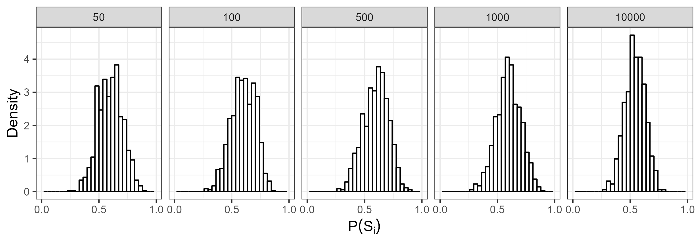

```{r global_options, include=FALSE}
knitr::opts_chunk$set(fig.width=3, fig.height=3, fig.crop = F, 
                      fig.pos = "tb", fig.path='figs/',
                      echo=F, warning=F, cache=F, 
                      message=F, sanitize = T)
```

```{r, libraries}
library(png)
library(grid)
library(ggplot2)
library(xtable)
```

```{=tex}
\NewEnviron{myequation}{%
\begin{equation}
\scalebox{1}{$\BODY$}
\end{equation}
}
```
# Introduction

Speakers are often confronted with many different ways to express the same meaning. A customer might ask whether a store sells "radios and televisions", but they could have just as naturally asked whether the store sells "televisions and radios." However, despite conveying the same meaning, speakers sometimes have strong preferences for one choice over competing choices [e.g., preference for *men and women* over *women and men*, @benor2006; @morgan2016]. These preferences are driven to some extent by generative preferences (e.g., preference for short words before long words), however they are sometimes violated by idiosyncratic preferences [e.g., *ladies and gentlemen* preferred despite a general men-before-women generative preference, @morganFrequencydependentRegularizationIterated2016].

Interestingly, ordering preferences for certain constructions, such as binomial expressions, are often more extreme for higher frequency items (e.g., *bread and butter*). That is, higher-frequency items typically have more polarized preferences [@liu2020; @liu2021; @morganFrequencydependentRegularizationIterated2016; @morganModelingIdiosyncraticPreferences2015; @morgan2016]. This phenomenon is called *frequency-dependent regularization*, and while there is evidence of it in several different constructions, it is still unclear what processes this phenomenon is driven by. For example, it could be a consequence of learning processes or a consequence of sentence processing more broadly. In the present paper we examine whether a noisy-channel processing model [@gibsonNoisy2013] combined with transmission across generations [@realiEvolutionFrequencyDistributions2009] can account for frequency-dependent regularization.

## Frequency-dependent regularization

Frequency-dependent regularization has been documented for a variety of different constructions in English [@liu2020; @liu2021; @morganFrequencydependentRegularizationIterated2016; @morganModelingIdiosyncraticPreferences2015]. For example, @morganModelingIdiosyncraticPreferences2015 demonstrated that more frequent binomial expressions (e.g., *bread and butter*) are more strongly regularized (i.e., are preferred in one order overwhelmingly more than the alternative). These ordering preferences are also not simply a result of generative ordering preferences [e.g., short words before long words, @morgan2016]. Interestingly, @morganFrequencydependentRegularizationIterated2016 even showed that the distribution of binomial orderings at the corpus-wide level are different than what would be expected given the generative preferences for the binomials (see Figure \ref{fig:corpusplot1}).

Additionally, @liu2020 demonstrated that dative alternation in English also shows evidence of frequency-dependent regularization (e.g., *give* *the ball to him* vs *give him the ball*). Specifically, they demonstrated higher frequency verbs have more polarized preferences with respect to the dative alternation. Similarly, @liu2021 showed that in adjective-adjective-noun constructions, the adjective orderings also show frequency-dependent regularization. That is, adjectives in adjective-adjective-noun constructions with higher overall frequencies (i.e., the summed counts of both orderings) show stronger ordering preferences, even after taking into account generative preferences of adjective orderings.

<!--# this bottom paragraph needs to be expanded -->

How does this polarization for high-frequency items arise? One possibility is that it occurs as a consequence of imperfect transmission between generations. For example, as speakers transmit the language from one generation to the next, it is possible that the next generation may imperfectly infer the probability of each ordering. Indeed, @morganFrequencydependentRegularizationIterated2016 demonstrated this possibility in an iterated-learning paradigm. They showed that frequency-dependent regularization can arise from an interaction between a frequency-independent regularization bias and transmission across generations. They argued that frequency-dependent regularization emerges because for low-frequency items, the regularization bias cannot overcome the learner's generative preferences.

In other words, it's possible that while learners of a language are in general very good at learning the statistical patterns in the language [e.g., @saffranStatisticalLearning8MonthOld1996; @yuRapidWordLearning2007], they may do so imperfectly and with a bias towards regularization. For example, if a learner hears 70 tokens of *bread and butter* and 30 tokens of *butter and bread*, they may imperfectly infer the ordering preference and transmit the language with a more skewed distribution (e.g., 75 tokens *bread and butter* and 25 tokens of *butter and bread*). On the other hand, for lower frequency items learners may rely more on their generative preferences because they haven't heard the item very much. As this occurs over many generations, it may result in frequency-dependent regularization.

While there is good evidence that a frequency-independent regularization bias can account for frequency-dependent regularization across generations, however, it remains unclear what processes in language transmission is analogous to this regularization bias.

## Noisy-channel Processing

One possibility is that the frequency-independent regularization bias is a product of noisy-channel processing [@gibsonNoisy2013]. Listeners are confronted with a great deal of noise in the form of perception errors (e.g., a noisy environment) and even production errors [speakers don't always say what they intended to, @gibsonNoisy2013]. In order to overcome these errors, a processing system must take into account the noise of the system, for example by probabilistically determining whether the perceived utterance was infact intended by the speaker.

Indeed, there is evidence that our processing system does take noise into account. For example, @ganongPhoneticCategorizationAuditory1980 found that people will process a non-word as being a word under noisy conditions. Additionally, @feltyMisperceptionsSpokenWords demonstrated that when listeners do misperceive a word, the word that they believe to have heard tends to be higher frequency than the target word. Further, @keshevNoisyBetterRare2021 found that in Arabic, readers will even process ambiguous subject/object relative clauses as the more frequent interpretation, even if this interpretation compromises subject-verb agreement. These results taken together suggests that misperceptions may sometimes actually be a consequence of noisy-channel processing [although it's worth noting that good-enough processing theories also make very similar predictions, e.g., @ferreiraGoodEnoughApproach2007].

Further, people will even process *grammatical* utterances, as a more frequent or plausible interpretation [@levyNoisychannel2008; @poppelsStructuresensitiveNoiseInference2016; @christiansonThematicRolesAssigned2001], even going so far as to process two interpretations that cannot both be consistent with the original sentence. For example, @christiansonThematicRolesAssigned2001 demonstrated that when people read the sentence *While the man hunted the deer ran into the woods*, people will answer in the affirmative for both *Did the man hunt the deer?* and *Did the dear run into the woods?*. @levyNoisychannel2008 argued that this phenonenon was explained by noisy-channel processing, since a single insertion results in plausible, grammatical constructions for both meanings (*While the man hunted it the deer ran into the woods* vs *While the man hunted the deer it ran into the woods*).

In order to account for findings like these, @gibsonNoisy2013 developed a computational model that demonstrated how a system might take into account noise [see @levyNoisychannel2008 for a similar approach]. Specifically, their model operationalizes noisy-channel processing as a Bayesian process where a listener estimates the probability that their perception matches the speaker's intended utterance. Specifically, this is operationlized as being proportional to the prior probability of the intended utterance multiplied by the probability of the intended utterance being corrupted to the perceived utterance (See Equation \ref{eq:gibsonnoisy}):

```{=tex}
\begin{equation}
\label{eq:gibsonnoisy}
P(S_i|S_p) \propto P(S_i) P(S_i \to S_p)
\end{equation}
```
\noindent where $P(S_i|S_p)$ is the probability of the intended utterance the perceived utterance, $P(S_i)$ is the prior probability of the intended utterance, and $P(S_i \to S_p)$ is the probability of the perceived utterance ($S_p$) given the intended utterance ($S_i$). If the perceived utterance is *bread and butter*, for example, the listener can infer the probability that the intended utterance was *bread and butter* or *butter and bread*.

@gibsonNoisy2013's model made a variety of interesting predictions. For example, the model predicted that when people are presented with an implausible sentence (e.g., *the mother gave the candle the daughter*), they should be more likely to interpret the plausible version of the sentence (e.g., *the mother gave the candle to the daughter*) if there is increased noise (e.g., by adding syntactic errors to the filler items, such as a deleted function word). Their model also predicted that increasing the likelihood of implausible events (e.g., by adding more filler items that were implausible, such as *the girl was kicked by the ball*) should increase the rate of implausible interpretations of the sentence. Interestingly both of these results were born out in their experimental data. In a follow up study, @poppelsStructuresensitiveNoiseInference2016 further demonstrated that word-exchanges (e.g., *The ball kicked the girl* vs *The girl kicked the ball*) are also taken into account by comprehenders. These results taken together suggest that humans do utilize a noisy-channel system in processing.

Previous research has demonstrated that noisy-channel processing models may account for certain types of regularization [e.g., @ferdinandCognitiveRootsRegularization2019, @schneiderNoisyChannelModel2020]. For example, there is evidence that children who receive primarily non-native input learn language that is more similar to native speakers [@singletonWhenLearnersSurpass2004]. One explanation is that children attribute the low-frequency unpredictable items to noise and regularize them [@schneiderNoisyChannelModel2020]. @schneiderNoisyChannelModel2020 demonstrated that a noisy-channel model can account for this type of regularization. It is important to note, however, that this is a different type of regularization than the regularization we'll be examining in this paper. Specifically, as mentioned earlier, we'll be looking at cases where it is the *high-frequency* items that become regularized. It is outside the scope of this paper to reconcile these two different types of regularization, however one intuition is when regularizing low-frequency irregular forms, there is a clear regular candidate. However, in the case of binomials, there is no clear candidate form for the low-frequency form to be regularized into.

## Present Study

Given the evidence of noisy-channel processing, it is possible that the frequency-dependent regularization that @morganFrequencydependentRegularizationIterated2016 saw is a product of listeners' noisy-channel processing. Perhaps when learners hear the phrase *butter and bread*, they think the speaker intended *bread and butter*, which results in an activation of *bread and butter* even though they didn't hear it. This activation could potentially even be stronger for *bread and butter* than *butter and bread* in cases where the listener thinks the speaker made a mistake. Further, this may compound over time for high frequency items, but not for low frequency items. Thus, the present study examines whether @gibsonNoisy2013's noisy-channel processing model can also predict frequency-dependent regularization across generations of language transmission.

<!--# Emily's comment: Can I give an intuitive reason for why -->

# Dataset

Following @morganFrequencydependentRegularizationIterated2016, we use @morganModelingIdiosyncraticPreferences2015's corpus of 594 Noun-Noun binomial expressions (e.g., *bread and butter*). There is evidence that human binomial ordering preferences are driven by a combination of generative preferences and observed preferences. Generative preferences are abstract constraints on ordering preferences, such as a preference for short words before long words, or male-coded terms before female-coded terms. The observed preference for a given binomial is the percentage that a given binomial occurs in alphabetical vs nonalphabetical form. That is, if *cats and dogs* appears 40 times in a corpus, and *dogs and cats* appears 60 times, then the observed preference for the alphabetical form is 0.4. The corpus also contains the overall frequency (total count of alphabetical and nonalphabetical forms for a given binomial) which has been shown to affect the strength of ordering preferences [@morganFrequencydependentRegularizationIterated2016]. A detailed description of the constraints is listed below:

1.  The estimated generative preferences for each binomial, which are values between 0 and 1 representing the alphabetical ordering preferences (a neutral reference order) estimated from the above constraints, independent of frequency. The generative constraints are calculated using @morganModelingIdiosyncraticPreferences2015's model. Values closer to zero represent a generative preference for the nonalphabetical order, while values closer to 1 represent a generative preference for the alphabetical order.

2.  The observed binomial orderings preferences (hereafter: observed preferences) which are the proportion of binomial orderings that are in alphabetical order for a given binomial. A visualization of the distribution of observed preferences and generative preferences is included below in Figure \ref{fig:corpusplot1}.

3.  The overall frequency of a binomial expression (the frequency of AandB plus the frequency of BandA). Frequencies were obtained from the Google Books *n*-grams corpus [@linSyntacticAnnotationsGoogle2012], which is orders of magnitude larger than the language experience of an individual speaker, and thus provides reliable frequency estimates for these expressions.

```{r corpusplot1, echo = F, out.width = "100%", fig.align = 'center', warning = F, message = F, fig.cap = 'The left plot is a plot of the observed orderings of binomials in the corpus data from Morgan \\& Levy (2015), the right is the plot of the generative preferences of binomials in the same corpus.'}
knitr::include_graphics('Figures/corpus_plots.png')
```

# Model

Following @morganFrequencydependentRegularizationIterated2016, we use a 2-alternative iterated learning paradigm. In our iterated learning paradigm, at each generation, learners hear N tokens of a given binomial with some in alphabetical (AandB) and some in nonalphabetical (BandA) order. The learner's goal is to learn the ordering preferences for each binomial. After hearing all N tokens, the learner then produces N tokens to the next generation. This process then repeats. In terms of learning the ordering preference, @morganFrequencydependentRegularizationIterated2016 used a beta update with a prior of pseudocounts. When updating the ordering preferences, 1 pseudocount was added to the perceived binomial ordering. We modify this by instead having the learners update their ordering preferences in proportion to the probability that the intended utterance was alphabetical vs nonalphabetical.

Within a single generation, after hearing a single token, learners compute $P(S_i = AandB|S_p)$ and update their beliefs about prior probability of the ordering for a given binomial, $P(S_i)$, according to equations \ref{eq:psi} and \ref{eq:ptheta}. $\alpha_1$ and $\alpha_2$ are pseudocounts of the alphabetical and nonalphabetical forms respectively. The size of the update is proportional to how probable the learner believes it is that each order was intended.

```{=tex}
\begin{multline}
\label{eq:psi}
P(S_i) \\ \sim Bernoulli(p_{theta})
\end{multline}
```
```{=tex}
\begin{multline}
\label{eq:ptheta}
p_{theta} \\ \sim Beta(\alpha_1, \alpha_2)
\end{multline}
```
After hearing a token, learners compute $P(S_i = AandB|S_p)$ according to Equation \ref{eq:gibsonnoisy}. $P(S_i \to S_p)$ is a fixed noise parameter, which we will call $p_{noise}$. $p_{noise}$ represents the probability of the perceived binomial ordering being swapped by the learner (i.e., AandB being swapped to BandA or vice versa). $P(S_i)$ represents the learner's prior belief of the probability of the intended order of the binomial.

To initialize $p_{theta}$ before the learner hears any data, we used the mean and concentration parametrization of the beta distribution. The mean ($\mu$) represents the expectation of the distribution (the mean value of draws from the distribution). The concentration parameter ($\nu$) describes how dense the distribution is. Before the learner hears any data, $\mu$ is equal to the generative preference for the binomial [taken from @morganFrequencydependentRegularizationIterated2016]. $\nu$ is a free parameter, set to 10 for all simulations in this paper.[^1] $\alpha_1$ and $\alpha_2$ can also be expressed in terms of $\mu$ and $\nu$:

[^1]: Changing $\nu$ does not qualitatively change the pattern of the results for any simulations in the paper, as long as it's greater than 2.

```{=tex}
\begin{multline}
\label{eq:alpha1}
\alpha_1 \\ = \mu \cdot \nu
\end{multline}
```
```{=tex}
\begin{multline}
\label{eq:alpha2}
\alpha_2 \\ = (1-\mu) \cdot \nu
\end{multline}
```
For all future tokens, learners will use the updated $P(S_i)$ from the previous token, where $P(S_i = AandB)$ is the expectation of $p_\theta$. Crucially, this value will be different because of the update on the previous step.

```{=tex}
\begin{multline}
\label{eq:expectationptheta}
P(S_i = AandB) \\ = \mathbb{E}(p_\theta)
\end{multline}
```
We then use $P(S_i)$ and $p_{noise}$ to compute $P(S_i|S_p)$. If the perceived binomial is alphabetical (AandB), we compute the unnormalized probability of the alphabetical and nonalphabetical orderings according to the below equations. Note that the process is comparable if the perceived binomial is nonalphabetical.

```{=tex}
\begin{multline}
\label{eq:praw}
P_{raw}(S_i = AandB|S_p = AandB) \\ = P(S_i = AandB) \cdot (1 -  p_{noise})
\end{multline}
```
```{=tex}
\begin{multline}
\label{eq:prawtwo}
P_{raw}(S_i = BandA|S_p = AandB) \\ = (1 - P(S_i = AandB)) \cdot P_{noise}
\end{multline}
```
After calculating the unnormalized (raw) probabilities, they are then normalized:

```{=tex}
\begin{myequation}%
\label{eq:phatalpha}
\hat{p}_{\alpha} = \frac{P_{raw}(S_i = AandB|S_p = AandB)}{P_{raw}(S_i = AandB | S_p = AandB) + P_{raw}(S_i = BandA|S_p = AandB)} %
\end{myequation}
```
```{=tex}
\begin{equation}
\label{eq:phatnotalpha}
\hat{p}_{\neg\alpha} = 1 - \hat{P}(\alpha)
\end{equation}
```
\noindent where $\hat{p_\alpha}$ is the probability that the intended binomial order was the alphabetical order, and $\hat{p}_{\neg\alpha}$ is the probability that the intended binomial order was the nonalphabetical order.

We then update $\alpha_1'$ and $\alpha_2'$ to be used as the parameters of $p_\theta$ when the learner hears the next token. The learner then uses $\alpha_1'$ and $\alpha_2'$ to calculate $p_\theta$ and thus $P(S_i)$. This update is done according to the following equation:

```{=tex}
\begin{equation}
\label{eq:alpha1}
\alpha_1' = \alpha_1 + \hat{p}(\alpha)
\end{equation}
```
```{=tex}
\begin{equation}
\label{eq:alpha2}
\alpha_2' = \alpha_2 + \hat{p}(\neg\alpha)
\end{equation}
```
When the learner hears the next token, they use $\alpha_1'$ and $\alpha_2'$ to compute $P(S_i)$. Note that when the learner hears a binomial, they update their beliefs about the probability of both the alpahabetical *and* nonalphabetical forms of the binomial.

When the learner is done hearing N tokens and updating their beliefs of $P(S_i)$ for a given binomial, they then produce N tokens for the next generation of learners. These are generated binomially, where $\theta = P(S_i=AandB)$ is the inferred probability of the alphabetical form of a given binomial.

When producing each token, there is also a possibility that the speaker makes an error and produces an unintended ordering of the binomial. The speaker error is analogous to a speaker choosing to produce a binomial ordering (AandB or BandA), and then accidently flipping it. For example, perhaps they intended to say *butter and bread*, but accidentally said *bread and butter* (or vice versa). In order to model this, the speaker produces a token in the unintended order with probability $p_{SpeakerNoise}$. This is a fixed parameter in the model and remains constant across binomials and generations.

This process continues iteratively for $ngen$ generations.

# Results

We present our results in two main sections. The first section demonstrates the effects of the speaker and listener noise parameters ($p_{noise}$ and $p_{SpeakerNoise}$ respectively) on simulations of individual binomials. The aim of this section is to examine whether the model can account for frequency-dependent regularization across individual binomials varying in frequency.

The second section compares our model's predicted binomial orderings across a range of binomials to the real-world corpus-wide distribution. In this section, rather than simulating individual binomials, we simulate the distribution of binomial orderings across the entire dataset of binomials from @morganModelingIdiosyncraticPreferences2015 with the intent of examining whether our model can capture the corpus-wide distribution.

## Speaker vs Listener Noise

First we demonstrate that frequency-dependent regularization does not arise when there is no listener or speaker noise.[^2] Instead we see convergence to the prior, which is expected following @griffithsLanguageEvolutionIterated2007. They demonstrated that when learners sample from the posterior in an iterated learning paradigm, the stationary distribution converges to the prior. To confirm this, we simulated the evolution of a single binomial across 500 generations with various N (50, 100, 500, 1000, and 10,000). The generative preference was 0.6. 1000 chains were run. We then examined the model's inferred ordering preference in the final generation. A visualization of the results is presented in Figure \ref{fig:noNoisePlot}.

[^2]: All code and results can be found publicly available here: [redacted]

```{r noNoisePlot, echo = F, out.width = '100%', fig.align = 'center', warning = F, message = F, fig.cap = 'A plot of the distribution of simulated binomials at the 500th generation, varying in frequency. The top value represents N. On the x-axis is the predicted probability of producing the binomial in alphabetical form. On the y-axis is probability density. Speaker and listener noise was set to 0. The generative preference was 0.6, and nu was set to 10. 1000 chains were run. Note that all values of N produce dense distributions clustered around 0.6 (i.e., there is no frequency-dependent regularization).'}

```

We then systematically manipulated N, listener noise ($p_{noise}$) and speaker noise ($p_{SpeakerNoise}$). Specifically, we varied N across 100, 1000, and 10000, and listener and speaker noise were varied across 0, 0.02, 0.04, 0.06, 0.08, and 0.1. We ran simulations for every combination of these values (Figure \ref{fig:fullsimsplot}. For these simulations, the generative preference was set to 0.6 and 1000 chains were run across 500 generations.

Our results suggest that frequency-dependent regularization does arise from the model when noise is introduced, but only if listener noise is greater than speaker noise. Further our results demonstrate that if listener noise is greater than speaker noise, then the greater the difference between the listener and speaker noise, the stronger the regularization effect (this is demonstrated by moving vertically down the column labeled $p_{SpeakerNoise} = 0$ in Figure \ref{fig:fullsimsplot}).

Interestingly this regularization disappears if the listener's noise parameter is less than or equal to the speaker's noise parameter. For example, notice how if you split the plot along the diagonal, all the plots on the top half, including the diagonal, show no evidence of regularization. These graphs are all visualizations where the speaker noise is greater than the listener noise.

```{r fullsimsplot, echo = F, fig.env = 'figure*', out.width = "100%", warning = F, message = F, fig.cap = 'Our simulation results for every combination of speaker noise, listener noise, and N. N corresponds to the overall frequency of the binomial (count of AandB plus count of BandA) and varied across 100, 1000, and 10000. Both speaker and listener noise were varied across 0, 0.02, 0.04, 0.06, 0.08, and 0.1. The results demonstrate that frequency-dependent regularization only arises when listener noise is greater than speaker noise. The distributions in the plot demonstrate the inferred ordering preference at the 500th generation.'}

```

It is useful to revisit here what the speaker and listener noise parameters represent. The speaker noise parameter is how often the speaker produces an error and the listener noise parameter is the listeners' belief of how noisy the environment is. Note that a speaker error here is not whether the speaker produces the more frequent binomial ordering, but rather whether the speaker produces the intended binomial ordering. In other words, if a speaker intends to produce *butter and bread*, and instead produces *bread and butter*, this is an error in our model. Framed this way, it is perhaps unsurprising that we do not see regularization when the parameters equal each other, since in the long run any errors made by the speakers will be corrected for by the learner, essentially canceling eachother out (i.e., cancelled out on average).

Thus our model makes a novel prediction: In order to account for frequency-dependent regularization, listeners must be inferring more noise than speakers are actually producing.

## Corpus Data

Finally, we now demonstrate that our model also predicts the language-wide distribution of binomial preference strengths seen in the corpus data. In order to demonstrate this, we simulated model predictions for all 594 binomials from @morganModelingIdiosyncraticPreferences2015. The model estimated the ordering preference across 500 generations with 10 chains each. Values for the generative preference and N for each binomial were taken from [@morganModelingIdiosyncraticPreferences2015]'s corpus. Listener noise was set to 0.02 and speaker noise to 0.005. Our results demonstrate that our model can approximate the distribution in the corpus data (See Figure \ref{fig:corpusourmodel}).

```{r corpusourmodel, echo = F, out.width = '100%', fig.align = 'center', warning = F, message = F, fig.cap = 'A plot of the stationary distribution of ordering preferences in the corpus data from Morgan \\& Levy (2015) and the distribution of ordering preferences after 500 generations of our iterated learning model (left and right respectively). For our simulations, the binomial frequencies and generative preferences were matched with the corpus data. $\nu$ was set to 10, listener noise was set to 0.02, and speaker noise was set to 0.005.'}
knitr::include_graphics('Figures/corpus_plot_and_ours.png') 
```

# Conclusion

The present study examined whether a noisy-channel processing model [@gibson2013] integrated in an iterated learning model [@morganFrequencydependentRegularizationIterated2016] can capture the effects of frequency-dependent regularization. Our results demonstrate the frequency-dependent regularization can emerge from a noisy-channel processing model when listeners infer more noise in the environment than the speakers actually produce.

# References

```{r}
# References will be generated automatically by Pandoc and included here.
# The following code is some latex to format the bibliography. Do not remove it.
```

```{=tex}
\setlength{\parindent}{-0.1in} 
\setlength{\leftskip}{0.125in}
```
\noindent
