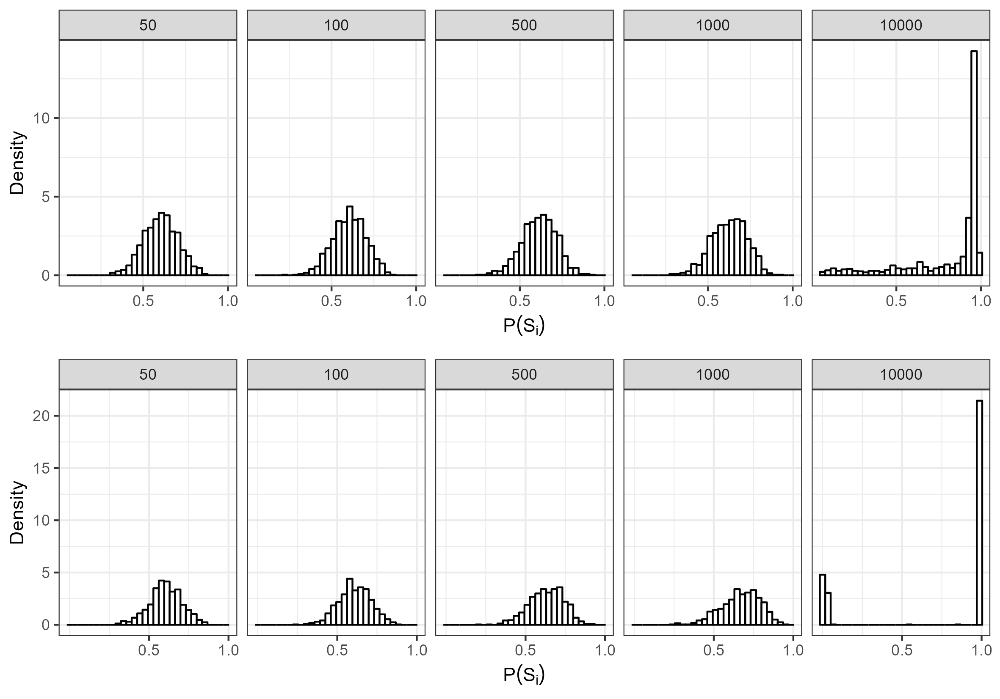
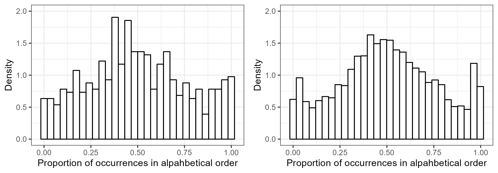

```{r global_options, include=FALSE}
knitr::opts_chunk$set(fig.width=3, fig.height=3, fig.crop = F, 
                      fig.pos = "tb", fig.path='figs/',
                      echo=F, warning=F, cache=F, 
                      message=F, sanitize = T)
```

```{r, libraries}
library(png)
library(grid)
library(ggplot2)
library(xtable)
```

# Introduction

Speakers are often confronted with many different ways to express the same meaning. A customer might ask whether a store sells "radios and televisions", but they could have just as naturally asked whether the store sells "televisions and radios." However, despite conveying the same meaning, speakers sometimes have strong preferences for one choice over competing choices [e.g., preference for *men and women* over *women and men*, @benor2006; @morgan2016]. These preferences are driven to some extent by generative preferences (e.g., preference for short words before long words), however they are sometimes violated by idiosyncratic preferences [e.g., *ladies and gentlemen* preferred despite a general men-before-women generative preference, @morganFrequencydependentRegularizationIterated2016].

Interestingly, ordering preferences for certain constructions, such as binomial expressions, are often more extreme for higher frequency items (e.g., *bread and butter*). That is, higher-frequency items typically have more polarized preferences [@liu2020; @liu2021; @morganFrequencydependentRegularizationIterated2016; @morganModelingIdiosyncraticPreferences2015; @morgan2016]. This phenomenon is called *frequency-dependent regularization*, and while there is evidence of it in several different constructions, it is still unclear what processes this phenomenon is driven by. For example, it could be a consequence of learning processes or a consequence of sentence processing more broadly. In the present paper we examine whether a noisy-channel processing model [@gibsonNoisy2013] combined with transmission across generations [@realiEvolutionFrequencyDistributions2009] can account for frequency-dependent regularization.

## Frequency-dependent regularization

Frequency-dependent regularization has been documented for a variety of different constructions in English [@liu2020; @liu2021; @morganFrequencydependentRegularizationIterated2016; @morganModelingIdiosyncraticPreferences2015]. For example, @morganModelingIdiosyncraticPreferences2015 demonstrated that more frequent binomial expressions (e.g., *bread and butter*) are more strongly regularized (i.e., are preferred in one order overwhelmingly more than the alternative). These ordering preferences are also not simply a result of abstract ordering preferences [e.g., short words before long words, @morgan2016].

Additionally, @liu2020 demonstrated this effect holds true for the dative alternation in English (e.g., *give* *the ball to him* vs *give him the ball*). Specifically, they demonstrated higher frequency verbs have more polarized preferences with respect to the dative alternation. Similarly, @liu2021 showed that Adjective-Adjective-Noun orderings also show frequency-dependent regularization. That is, adjective-adjective-Nouns with higher overall frequencies show stronger ordering preferences, even after taking into account generative preferences of adjective orderings.

<!--# this bottom paragraph needs to be expanded -->

How does this polarization for high-frequency items arise? One possibility is that it occurs as a consequence of imperfect transmission between generations. For example, as speakers transmit the language from one generation to the next, it is possible that the next generation may infer the probability of each ordering imperfectly. Indeed, @morganFrequencydependentRegularizationIterated2016 demonstrated this possibility in an iterated-learning paradigm. They showed that frequency-dependent regularization can arise from an interaction between a frequency-independent bias and transmission across generations. Specifically, they used an iterated learning paradigm [following @realiEvolutionFrequencyDistributions2009] and demonstrated that by introducing a frequency-independent regularization bias, after several generations the model predicted frequency-*dependent* regularization. For example, after hearing *bread and butter* 7 times, and *butter and bread* 3 times, the learner might reproduce *bread and butter* 8 times and *butter and bread* 2 times. They argued that frequency-dependent regularization emerges because for low-frequency items, the regularization bias cannot overcome the prior. In other words, the model posits that while learners of a language are in general very good at learning the statistical patterns in the language [@saffranStatisticalLearning8MonthOld1996; @yuRapidWordLearning2007], they may do so imperfectly. Despite the evidence of frequency-dependent regularization, however, it is unclear what process in language is analogous to the frequency-independent regularization bias.

## Noisy-channel Processing

One possibility is that frequency-dependent regularization arises as a product of noisy-channel processing [@gibsonNoisy2013]. Listeners are confronted with a great deal of noise in the form of perception errors (e.g., a noisy environment) and even production errors [speakers don't always say what they intended to, @gibsonNoisy2013]. In order to overcome these errors, a processing system must take into account the noise of the system, for example by probabilistically determining whether the perceived utterance was infact intended by the speaker.

Indeed, there is evidence that our processing system does take noise into account. For example, @ganongPhoneticCategorizationAuditory1980 found that people will process a non-word as being a word under noisy conditions. Additionally, @feltyMisperceptionsSpokenWords demonstrated that when listeners do misperceive a word, the word that they believe to have heard tends to be higher frequency than the target word. Further, @keshevNoisyBetterRare2021 found that in Arabic, readers will even process ambiguous subject/object relative clauses as the more frequent interpretation, even if this interpretation compromises subject-verb agreement. These results taken together suggests that misperceptions may sometimes actually be a consequence of noisy-channel processing [though see @ferreiraGoodEnoughApproach2007 for an alternative account].

Further, people will even process *grammatical* utterances, as a more frequent or plausible interpretation [@levyNoisychannel2008; @poppelsStructuresensitiveNoiseInference2016; @christian; @christiansonThematicRolesAssigned2001], even going so far as to process two interpretations that cannot both be consistent with the original sentence. For example, @christiansonThematicRolesAssigned2001 demonstrated that when people read the sentence *While the man hunted the deer ran into the woods*, people will answer in the affirmative for both *Did the man hunt the deer?* and *Did the dear run into the woods?*. @levyNoisychannel2008 argued that this phenonenon was explained by noisy-channel processing, since a single insertion results in plausible, grammatical constructions for both meanings (*While the man hunted it the deer ran into the woods* vs *While the man hunted the deer it ran into the woods*).

In order to account for findings like these, @gibsonNoisy2013 developed a computational model that demonstrated how a system might take into account noise [see @levyNoisychannel2008 for a similar approach]. Specifically, their model operationalizes noisy-channel processing as a Bayesian process where a listener estimates the probability that their perception matches the speaker's intended utterance. Specifically, this is operationlized as being proportional to the prior probability of the intended utterance multiplied by the probability of the intended utterance being corrupted to the perceived utterance (See Equation \ref{eq:gibsonnoisy}):

```{=tex}
\begin{equation}
\label{eq:gibsonnoisy}
P(S_i|S_p) \propto P(S_i) P(S_i \to S_p)
\end{equation}
```
\noindent where $P(S_i|S_p)$ is the probability that the intended utterance was actually the utterance that was perceived, $P(S_i)$ is the prior probability of the intended utterance, and $P(S_i \to S_p)$ is the probability of the perceived utterance ($S_p$) given the intended utterance ($S_i$). For example, if $S_p =$ *bread and butter*, then in order to infer the probability *bread and butter* being the intended utterance of the speaker ($P(S_i)=$ *bread and butter)*, we multiply the prior probability of *bread and butter,* $P(S_i)$, by the probability of the perceived utterance being *bread and butter* given the intended utterance being *bread and butter,* $P(S_p =$ *bread and butter* \| $S_i=$ *bread and butter*). Another way to conceptualize $P(S_p =$ *bread and butter* \| $S_i=$ *bread and butter*) is 1 - the probability that the speaker said something *other* than *bread and butter*, given that they intended to say *bread and butter*.

@gibsonNoisy2013's model made a variety of interesting predictions. For example, the model predicted that when people are presented with an implausible sentence (e.g., *the mother gave the candle the daughter*), they should be more likely to interpret the plausible version of the sentence (e.g., *the mother gave the candle to the daughter*) if there is increased noise (e.g., by adding syntactic errors to the filler items, such as a deleted function word). Their model also predicted that increasing the likelihood of implausible events (e.g., by adding more filler items that were implausible, such as *the girl was kicked by the ball*) should increase the rate of implausible interpretations of the sentence. Interestingly both of these results were born out in their experimental data. In a follow up study, @poppelsStructuresensitiveNoiseInference2016 further demonstrated that word-exchanges (e.g., *The ball kicked the girl* vs *The girl kicked the ball*) are also taken into account by comprehenders. These results taken together suggest that humans do utilize a noisy-channel system in processing.

## Present Study

Given the evidence of noisy-channel processing, it is possible that the frequency-dependent regularization that @morganFrequencydependentRegularizationIterated2016 saw is a product of listeners' noisy-channel processing. That is, perhaps when learners hear the phrase *butter and bread*, they think the speaker intended *bread and butter*, and thus also activates *bread and butter* even though they didn't hear it. Further, this may compound over time for high frequency items, but not for low frequency items. Thus, the present study examines whether @gibsonNoisy2013's noisy-channel processing model can also predict frequency-dependent regularization across generations of language transmission.

<!--# Emily's comment: Can I give an intuitive reason for why -->

# Dataset

Following @morganFrequencydependentRegularizationIterated2016, we use @morganModelingIdiosyncraticPreferences2015's corpus of 594 binomial expressions. This corpus has been annotated for various phonological, semantic, and lexical constraints that are known to affect binomial ordering preferences. The corpus also includes:

1.  The estimated generative preferences for each binomial, which are values between 0 and 1 representing the ordering preferences estimated from the above constraints, independent of frequency. The generative constraints are calculated using @morganModelingIdiosyncraticPreferences2015's model.

2.  The observed binomial orderings preferences (hereafter: observed preferences) which are the proportion of binomial orderings that are in alphabetical order (a neutral reference order) for a given binomial. A visualization of the distribution of observed preferences and compositional preferences is included below in Figure \ref{fig:corpusplot1}.

3.  The overall frequency of a binomial expression (the frequency of AandB plus the frequency of BandA).

```{r corpusplot1, echo = F, out.width = "100%", fig.align = 'center', warning = F, message = F, fig.cap = 'The left plot is a plot of the observed orderings of binomials in the corpus data from Morgan \\& Levy (2015), the right is the plot of the generative preferences of binomials in the same corpus.'}
knitr::include_graphics('Figures/corpus_plots.png')
```

# Model

Following @morganFrequencydependentRegularizationIterated2016, we use a 2-alternative iterated learning paradigm. At very step, learners hear N tokens with some in alphabetical (AandB) and some in nonalphabetical (BandA) order. After hearing all N tokens, the learner then produces N tokens to the next generation.

Within a single generation, after hearing a single token, learners compute $P(S_i = AandB|S_p)$ and update their beliefs about prior probability of the ordering for a given binomial, $P(S_i)$. The size of the update is proportional to how probable the learner believes it is that each order was intended.

After hearing a token, learners compute $P(S_i = AandB|S_p)$ according to Equation \ref{eq:gibsonnoisy}. $P(S_i \to S_p)$ is a fixed noise parameter, which we will call $P_{noise}$. $P_{noise}$ represents the probability of the perceived binomial ordering being swapped by the learner (i.e., AandB being swapped to BandA or vice versa). $P(S_i)$ represents the learner's prior belief of the probability of the intended order of the binomial.

To initialize $P(S_i)$ before the learner hears any data, we used the mean and concentration parametrization of the beta distribution. The mean ($\mu$) represents the expectation of the distribution (the mean value of draws from the distribution). The concentration parameter ($\nu$) describes how dense the distribution is.

Before the learner hears any data, $\mu$ is equal to the generative preference for the binomial [taken from @morganFrequencydependentRegularizationIterated2016]. $\nu$ is a free parameter, set to 10 for all simulations in this paper.[^1]

[^1]: Changing $\nu$ does not qualitatively change the pattern of the results for any simulations in the paper, as long as it's greater than 2.

We then use $P(S_i)$ and $P(noise)$ to compute $P(S_i|S_p)$. If the perceived binomial is alphabetical (AandB), we compute the unnormalized probability of the alphabetical and nonalphabetical orderings according to the below equations. Note that the process is comparable if the perceived binomial is nonalphabetical.

```{=tex}
\begin{equation}
\label{eq:praw}
P_{raw}(S_i = AandB|S_p = AandB) \\ = P(S_i = AandB) \cdot (1 -  P(noise))
\end{equation}
```
```{=tex}
\begin{equation}
\label{eqprawtwo}
P_{raw}(S_i = BandA|AandB) = (1 - P(S_i = AandB)) \cdot P(noise)
\end{equation}
```
On the first trial, $P(S_i = AandB)$ = $\mu$.

After calculating the unnormalized (raw) probabilities, they are then normalized:

```{=tex}

\scalebox{0.8}{%
normal:
\begin{equation}
\label{eq:phatalpha}
\hat{P}_{\alpha} = \frac{P_{raw}(S_i = AandB|S_p = AandB)}{P_{raw}(S_i = AandB | S_p = AandB) + P_{raw}(S_i = BandA|S_p = AandB)}
\end{equation}}
```
```{=tex}
\begin{equation}
\label{eq:phatnotalpha}
\hat{P}_{\neg\alpha} = 1 - \hat{P}(\alpha)
\end{equation}
```
\noindent where $\hat{P_\alpha}$ is the probability that the intended binomial order was the alphabetical order, and $\hat{P}_{\neg\alpha}$ is the probability that the intended binomial order was the nonalphabetical order.

We then update $\alpha_1'$ and $\alpha_2'$ to be used as the parameters of $P(S_i)$ when the learner hears the next token. For updating we use the pseudocount parametrization, where $\alpha_1 = \mu \cdot \nu$ and $\alpha_2 = 1-\mu \cdot \nu$. This update is done according to the following equation:

```{=tex}
\begin{equation}
\label{eq:alpha1}
\alpha_1' = \alpha_1 + \hat{P}(\alpha)
\end{equation}
```
```{=tex}
\begin{equation}
\label{eq:alpha2}
\alpha_2' = \alpha_2 + \hat{p}(\neg\alpha)
\end{equation}
```
When the learner hears the next token, they use $\alpha_1'$ and $\alpha_2'$ to compute $P(S_i)$. Note that when the learner hears a binomial, they update their beliefs about the probability of both the alpahabetical *and* nonalphabetical forms of the binomial.

When the learner is done hearing N tokens and updating their beliefs of $P(S_i)$ for a given binomial, they then produce N tokens for the next generation of learners. These are generated binomially, with $\theta = P(S_i=AandB)$ is the inferred probability of the alphabetical form of a given binomial.

When producing each token, there is also a possibility that the speaker makes an error and produces an unintended ordering of the binomial. In order to model this, the speaker produces a token in the unintended order with probability $P_{SpeakerNoise}$. This is a fixed parameter in the model and remains constant across binomials and generations.

This process continues iteratively for $ngen$ generations.

# Results

We present our results in two main sections. The first section demonstrates the effects of the speaker and listener noise parameters ($P_{noise}$ and $P_{SpeakerNoise}$ respectively) on simulations of individual binomials. The goal of this section is to examine whether the model can account for frequency-dependent regularization across individual binomials varying in frequency.

The second section compared our model's predicted binomial orderings across a range of binomials to the real-world corpus-wide distribution. In this section, rather than simulating individual binomials, we simulated the distribution of binomial orderings across the entire dataset of binomials from @morganModelingIdiosyncraticPreferences2015 with the intent of examining whether our model can capture the corpus-wide distribution.

## Speaker vs Listener Noise

First we demonstrate that frequency-dependent regularization does not arise when there is no listener or speaker noise.[^2] Instead we see convergence to the prior, which is expected. That is, @griffithsLanguageEvolutionIterated2007 demonstrated that when learners sample from the posterior, as the number of iterations increases, the stationary distribution converges to the prior. In other words, without any noise, each generation of learners produces data that is more and more similar to the prior, until convergence is reached. To confirm this, we simulated the evolution of a single binomial across 500 generations and, with various frequencies (50, 100, 500, 1000, and 10,000). The generative preference was 0.6. 1000 chains were run. We then examined the model's inferred ordering preference in the final generation. A visualization of the results is presented in Figure \ref{fig:noNoisePlot}.

[^2]: All code and results can be found publicly available here: [redacted]

```{r noNoisePlot, echo = F, out.width = '100%', fig.align = 'center', warning = F, message = F, fig.cap = 'A plot of the distribution of simulated binomials at the 500th generation, varying in frequency. The top value represents N. On the x-axis is the predicted probability of producing the binomial in alphabetical form. On the y-axis is probability density. Speaker and listener noise was set to 0. The generative preference was 0.6, and nu was set to 10. 1000 chains were run. Note that there is no frequency-dependent regularization apparent.'}
knitr::include_graphics('Figures/noNoise.png')
```

In a follow-up simulation, we introduced speaker and listener noise to examine the evolution of a single binomial across 500 generations. Similarly, we varied the frequencies (50, 100, 500, 1000, and 10,000), set the generative preference to 0.6, and ran 1000 chains. The key difference is that in this simulation, speaker noise ($P_{SpeakerNoise}$) was set when we to 0.001 and listener noise $P_{noise}$ was set to 0.01. Interestingly, introducing noise results in predicted frequency-dependent regularization across generations (Figure \ref{fig:regularizationplot1}).

```{r regularizationplot1, echo = F, out.width = '100%', fig.align = 'center', warning = F, message = F, fig.cap = 'A plot of the distribution of simulated binomials at the 500th generation, varying in frequency. The top value represents N. On the x-axis is the predicted probability of producing the binomial in alphabetical form. On the y-axis is probability density. Speaker noise was set to 0.001, listener noise was set to 0.01, the generative preference was 0.6, and nu was set to 10. 1000 chains were run. Note how for the binomials with large N, the ordering preferences tend to be more extreme.'}
knitr::include_graphics('Figures/speaker_noise_001_listener_01.png')
```

Further, the disparity of the noise affects the rate of regularization (see Figure \ref{fig:absolutediff}). To demonstrate this, we replicated the same simulations as above but with different speaker and listener values. Specifically, we ran a simulation with the speaker noise parameter set to 0.091 and the listener noise set to 0.1 (top plot in \ref{fig:absolutediff}) and another with speaker noise set to 0.001 and listener noise set to 0.01 (bottom plot in Figure \ref{fig:absolutediff}). Note that the difference between the speaker and listener noise for both was the same.

Interestingly, a larger difference between the speaker and listener noise parameters increases the strength of the regularization. To examine this, we simulated across the same frequency span as before (50, 100, 500, 1000, 10000), with generative preference set to 0.6, however we varied the speaker noise parameter. Since regularization occurred more slowly, we ran the simulation for 2000 generations to ensure that we arrived at the stationary distribution. For both simulations, listener noise was set to 0.01, however in one simulation (top of Figure \ref{fig:fasterslowerreg}), speaker noise was set to 0.009 and in another simulation (bottom of Figure \ref{fig:fasterslowerreg}), speaker noise was set to 0.0075. As Figure \ref{fig:fasterslowerreg} demonstrates, Increased noise results in weaker regularization (i.e., less regularization for lower frequency items in the left plot compared to the right plot).

```{r fasterslowerreg, echo = F, out.width = '100%', fig.align = 'center', warning = F, message = F, fig.cap = 'A plot of simulations with different noise parameters after 2000 generations. For the top plot, the speaker noise was set to 0.009 and the listener noise parameter was set to 0.01. For the bottom plot, the speaker noise was set to 0.0075 and the listener noise parameter was set to 0.01. For both plots, the generative preference was set to 0.6 and nu was set to 10.'}

```

```{r absolutediff, echo = F, out.width = '100%', fig.align = 'center', warning = F, message = F, fig.cap = 'A plot of simulations with different noise parameters, but the same difference between the speaker and listener noise parameters. For the top plot, the speaker noise was set to 0.091 and listener noise was set to 0.1. For the bottom plot, the speaker noise was set to 0.001 and listener noise was set to 0.01. Note that the difference between the listener and speaker noise parameters for both plots was the same (0.009).'}
knitr::include_graphics('Figures/absolute_matters.png')
```

Interestingly this regularization disappears if the listener's noise parameter is less than or equal to the speaker's noise parameter. To examine this, we ran a simulation using the same frequency and generative preferences settings as before, but we varied the listener and speaker noise parameters. Specifically, listener noise was set to 0.001 and speaker noise was set to 0.01. We ran the simulation across 500 generations. The simulations demonstrate that when listener noise is less than speaker noise, regularization does not occur (Figure \ref{fig:regularizationplot2}).

```{r regularizationplot2, echo = F, out.width = '100%', fig.align = 'center', warning = F, message = F, fig.cap = 'A plot of the distribution of simulated binomials at the 500th generation, varying in frequency. The top value represents N. On the x-axis is the predicted probability of producing the binomial in alphabetical form. On the y-axis is probability density. Speaker noise was set to 0.01, listener noise was set to 0.001, the generative preference was 0.6, and nu was set to 10. 1000 chains were run. Note how regularization does not appear to be present in this graph.'}
knitr::include_graphics('Figures/speaker_noise_01_listener_001.png')

```

It is useful to revisit here what the speaker and listener noise parameters represent. The speaker noise parameter is how often the speaker produces an error and the listener noise parameter is the listeners' belief of how noisy the environment is. Framed this way, it is perhaps unsurprising that we do not see regularization when the parameters equal eachother, since they essentially cancel eachother out (everytime a speaker makes an error, the listener is accounting for it, thus we get convergence to the prior).

Thus our model makes a novel prediction: In order to account for frequency-dependent regularization, listeners must be inferring more noise than speakers are actually producing (according to our model).

## Corpus Data

Finally, we now demonstrate that our model also predicts the language-wide distribution of binomial preference strengths seen in the corpus data. In order to demonstrate this, we simulated model predictions for the 594 binomials from @morganModelingIdiosyncraticPreferences2015. The model estimated the ordering preference across 500 generations with 10 chains each. The generative preference and N was dependent on the binomial. We also set listener noise to 0.02 and speaker noise to 0.005. Our results demonstrate that our model can approximate the distribution in the corpus data (See Figure \ref{fig:corpusourmodel}).

```{r corpusourmodel, echo = F, out.width = '100%', fig.align = 'center', warning = F, message = F, fig.cap = 'A plot of the distribution of ordering preferences after 500 generations of our iterated learning model (left) and the stationary distribution of ordering preferences in the corpus data from Morgan \\& Levy (2015). For our simulations, the binomial frequencies and generative preferences were matched with the corpus data. $\nu$ was set to 10, listener noise was set to 0.02, and speaker noise was set to 0.005.'}
 
```

# Conclusion

The present study examined whether a noisy-channel processing model [@gibson2013] integrated in an iterated learning model [@morganFrequencydependentRegularizationIterated2016] can capture the effects of frequency-dependent regularization.

Our results demonstrate the frequency-dependent regularization can emerge from a noisy-channel processing model when listeners encounter more noise in the environment than the speakers actually produce.

Further our results suggest that in order to account for frequency-dependent regularization, listeners are encountering more noise than speakers are producing. An interesting avenue for future research is whether this prediction is born out in experimental work.

# References

```{r}
# References will be generated automatically by Pandoc and included here.
# The following code is some latex to format the bibliography. Do not remove it.
```

```{=tex}
\setlength{\parindent}{-0.1in} 
\setlength{\leftskip}{0.125in}
```
\noindent
