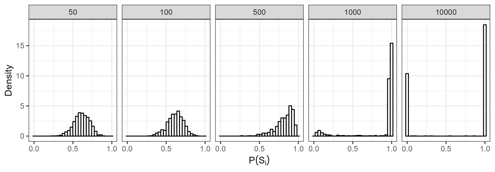

```{r setup, include = FALSE}
library("papaja")
r_refs("r-references.bib")


```

```{r analysis-preferences}
# Seed for random number generation
set.seed(42)
knitr::opts_chunk$set(cache.extra = knitr::rand_seed)
```

# Introduction

Speakers often have great flexibility in their choices to convey a meaning. For example, speakers are often confronted with many different ways to express the same meaning. A customer might ask whether a store sells "radios and televisions", but they could have just as naturally asked whether the store sells "televisions and radios." However, despite conveying the same meaning, speakers sometimes have strong preferences for one choice over competing choices. For example, speakers prefer *men and women* to *women and men* [@morgan2016; @benor2006], and this preference is more extreme for higher frequency items (e.g., *bread and butter*). That is, higher-frequency items typically have more polarized preferences [@liu2020; @liu2021; @morganFrequencydependentRegularizationIterated2016; @morganModelingIdiosyncraticPreferences2015]. Specifically, @morganModelingIdiosyncraticPreferences2015 demonstrated that more frequent binomial expressions (e.g., *bread and butter*) are more strongly regularized (i.e., are preferred in one order overwhelmingly more than the alternative). Further, @liu2020 demonstrated that this phenomenon holds true for the dative alternation in English as well (*give him the ball* vs *give the ball to him*).

How does this polarization for high-frequency items arise? One possibility is that it occurs as a consequence of imperfect transmission between generations. For example, @morganFrequencydependentRegularizationIterated2016 demonstrated that in an iterated-learning paradigm [@realiEvolutionFrequencyDistributions2009], this frequency-dependent regularization can arise from an interaction between a frequency-independent bias and transmission across generations. Specifically, they used an iterated learning paradigm [following @realiEvolutionFrequencyDistributions2009] and demonstrated that by introducing a frequency-independent regularization bias, after several generations the model predicted frequency-*dependent* regularization.

However, it is unclear what the process in language is analogous to the frequency-independent bias. One possibility is that it arises as a product of noisy-channel processing [@gibsonNoisy2013]. That is, listeners are confronted with a great deal of noise in the form of perception errors (perhaps due to a noisy environment) and even production errors (speakers don't always say what they intended to) [@gibsonNoisy2013]. In order to overcome these errors, a processing system must take into account the noise of the system. @gibsonNoisy2013 developed a computational model that demonstrated how a system might take into account noise. Specifically, his model operationalizes noisy-channel processing as a Bayesian process where a listener computes the probability that their perception matches the speakers intended utterance as being proportional to the likelihood of the intended utterance times the probability of the intended utterance being corrupted to the perceived utterance (See equation 1):

```{=tex}
\begin{equation}
(\#eq:gibsonnoisy)
P(S_i|s_p) \propto P(S_i) P(S_i \to S_p)
\end{equation}
```
@gibsonNoisy2013's model made a variety of interesting predictions. For example, the model predicted that when people are presented with an implausible sentence (e.g., *the mother gave the candle the daughter*), they should be more likely to interpret the plausible version of the sentence (e.g., *the mother gave the candle to the daughter*) if there is increased noise (e.g., by adding errors to the filler items). Their model also predicted that increasing the likelihood of implausible events should increase the rate of implausible interpretations of the sentence. Interestingly both of these results were born out in their experimental data, suggesting that humans do engage a noisy-channel system in processing.

@gibsonNoisy2013 is not the only evidence of noisy-channel processing either. There's evidence from the word-identification literature as well that people engage in noisy-channel processing. For example, @feltyMisperceptionsSpokenWords demonstrated that when listeners do misperceive a word, the word that they believe to have heard tends to be higher frequency than the target word. This suggests that misperceptions may sometimes actually be a consequence of noisy-channel processing (rather than a failure of our perceptual system).

All this taken together, it is possible that the frequency-dependent regularization that @morganFrequencydependentRegularizationIterated2016 saw is a product of listeners' noisy-channel processing. Thus, the present study examines whether @gibsonNoisy2013's noisy-channel processing model can also predict frequency-dependent regularization.

# Dataset

Following @morganFrequencydependentRegularizationIterated2016, we use @morganModelingIdiosyncraticPreferences2015's corpus of 594 binomial expressions. This corpus has been annotated for various phonological, semantic, and lexical constraints that are known to affect binomial ordering preferences. The corpus also includes estimated generative preferences for each binomial (i.e., compositional ordering preferences, estimated from the above constraints) and observed binomial orderings (the proportion of the binomials that occur in alphabetical form). The observed binomial orderings are the number of times the binomial occurred in alphabetical form divided by the total times the binomial occurred in both alphabetical and non-alphabetical form. A visualization of the observed preferences and compositional preferences is included below in Figure , on the left and right respectively.

(ref:corpusplotcaption1) The left plot is a plot of the relative orderings of binomials in the corpus data from @morganModelingIdiosyncraticPreferences2015, the right is the plot of the generative preferences of binomials in the same corpus. The x-axis is proportion of occurrences in alphabetical order and the y-axis is the probability density.

```{r corpusplot1, echo = F, out.width = '100%', fig.align = 'center', warning = F, message = F, fig.cap = '(ref:corpusplotcaption1)'}
knitr::include_graphics('Figures/corpus_plots.png')
```

# Model

Following @realiEvolutionFrequencyDistributions2009, we use a 2-alternative iterated learning paradigm. A learner hears N tokens of a binomial expression and then produces N tokens for the next generation. After hearing N tokens, they infer the probability, $\theta$, of the alphabetical form of the binomial. Using that probability, they then produce N tokens for the next generation, and this process continues iteratively.

The prior probability of a binomial's ordering is operationalized using the beta distribution [following @morganFrequencydependentRegularizationIterated2016]. Specifically, we treat the generative preference for a given binomial as the prior for our model. This is operationalized using the beta distribution with $\mu_{prior}$, which is the generative preference for a given binomial, and $\nu$, which determines the strength of the belief of the prior probability. Thus the prior probability for a given binomial in its alphabetical form is estimated as:

```{=tex}
\begin{equation}
(\#eq:thetaPrior)
P(\theta_{prior}) = \frac{\mu_{prior} \cdot \nu}{(\mu_{prior} \cdot \nu) + (1 - \mu_{prior}) \cdot \nu}
\end{equation}
```
and the probability of hearing it in non-alphabetical form is $1-P(\theta_{prior})$.

This is then used as the prior in @gibsonNoisy2013's noisy-channel processing model, such that if a listener hears the alphabetical form of a binomial they update the probability of hearing it in alphabetical form according to the following parametrization,

```{=tex}
\begin{equation}
(\#eq:phatAlpha)
\hat{p}(\alpha) \propto \frac{\mu_{prior} \cdot \nu}{(\mu_{prior} \cdot \nu) + (1 - \mu_{prior}) \cdot \nu} \cdot p_{noise}
\end{equation}
```
where $1 - p_{noise}$ is a fixed parameter for every binomial. They also update the probability of hearing the non-alphabetical form:

```{=tex}
\begin{equation}
(\#eq:phatNonalpha)
\hat{p}(\neg\alpha) \propto 1 - \frac{\mu_{prior} \cdot \nu}{(\mu_{prior} \cdot \nu) + (1 - \mu_{prior}) \cdot \nu} \cdot (1-p_{noise})
\end{equation}
```
If the listener hears the non-alphabetical form of the binomial, they update using the same equations, but with a slight change to the noise parameter:

```{=tex}
\begin{equation}
(\#eq:phatAlpha2)
\hat{p}(\alpha) \propto \frac{\mu_{prior} \cdot \nu}{(\mu_{prior} \cdot \nu) + (1 - \mu_{prior}) \cdot \nu} \cdot p_{noise} 
\end{equation}
```
and,

```{=tex}
\begin{equation}
(\#eq:phatNonalpha2)
\hat{p}(\neg\alpha) \propto 1 - \frac{\mu_{prior} \cdot \nu}{(\mu_{prior} \cdot \nu) + (1 - \mu_{prior}) \cdot \nu} \cdot (1-p_{noise}) 
\end{equation}
```
Finally, before $\hat{p}_\alpha$ and $\hat{p}_{\neg\alpha}$ are updated, the values above are normalized such that they sum to 1.

Once the learner finishes hearing N tokens, they then produce N tokens generated binomially, where $\theta_1$ is their inferred probability of the alphabetical form of the given binomial (which is set to 0.5 for the first generation):

```{=tex}
\begin{equation}
(\#eq:binomialProd)
P(x_1|\theta_1) = \binom{N}{x_1} \theta^{x_1} (1-\theta_1)^{N-x_1}
\end{equation}
```
When the learner produces the N tokens, there is also a possibility the speaker will make an error. This is also generated binomially, with $\theta_1$ being a fixed parameter, which is the probability that the learner makes an error. In our model, if the learner makes an error, the opposite binomial form is produced. For example, if the learner intends to produce the alphabetical form and makes an error, the non-alphabetical form is produced.

# Results

## Speaker vs Listener Noise

First we show that the noisy-channel processing model can predict frequency-dependent regularization across generations, presented in Figure \@ref(fig:regularizationplot1)[^1].

[^1]: All code and results can be found publicly available here: <https://github.com/znhoughton/Noisy-Channel-Iterated-Learning>

(ref:regularizationPlot1Cap) A plot of the distribution of simulated binomials at the 500th generation, varying in frequency. The top value represents N. On the x-axis is the predicted probability of producing the binomial in alphabetical form. On the y-axis is probability density. Speaker noise was set to 0.001, listener noise was set to 0.01, the generative preference was 0.6, and nu was set to 10. 1000 chains were run. Note how for the binomials with large N, the ordering preferences tend to be more extreme.

```{r regularizationplot1, echo = F, out.width = '100%', fig.align = 'center', warning = F, message = F, fig.cap = '(ref:regularizationPlot1Cap)'}

```

Interestingly this regularization disappears if the listener's noise parameter is less than or equal to the speaker's noise parameter (Figure \@ref(fig:regularizationplot2)).

(ref:regularizationPlot2Cap) A plot of the distribution of simulated binomials at the 500th generation, varying in frequency. The top value represents N. On the x-axis is the predicted probability of producing the binomial in alphabetical form. On the y-axis is probability density. Speaker noise was set to 0.01, listener noise was set to 0.001, the generative preference was 0.6, and nu was set to 10. 1000 chains were run. Note how regularization does not appear to be present in this graph.

```{r regularizationplot2, echo = F, out.width = '100%', fig.align = 'center', warning = F, message = F, fig.cap = '(ref:regularizationPlot2Cap)'}
knitr::include_graphics('Figures/speaker_noise_01_listener_001.png')

```

## Corpus Data

Finally, we now demonstrate that our model also predicts the language-wide distribution of binomial preference strengths seen in the corpus data. Specifically, we show that with $\nu=10$, listener noise set to 0.02, and speaker noise set to 0.005, our model does a pretty good job of approximating the distribution in the corpus data (See Figure \@ref(fig:corpusourmodel)).

(ref:corpusourmodelcap) A plot of the distribution of ordering preferences after 500 generations of our iterated learning model (left) and the distribution of ordering preferences in the corpus data from @morganModelingIdiosyncraticPreferences2015. For our simulations, the binomial frequencies and generative preferences were matched with the corpus data. $\nu$ was set to 10, listener noise was set to 0.02, and speaker noise was set to 0.005.

```{r corpusourmodel, echo = F, out.width = '100%', fig.align = 'center', warning = F, message = F, fig.cap = '(ref:corpusourmodelcap)'}
knitr::include_graphics('Figures/corpus_plot_and_ours.png') 
```

# Conclusion

\newpage

# References

::: {#refs custom-style="Bibliography"}
:::
