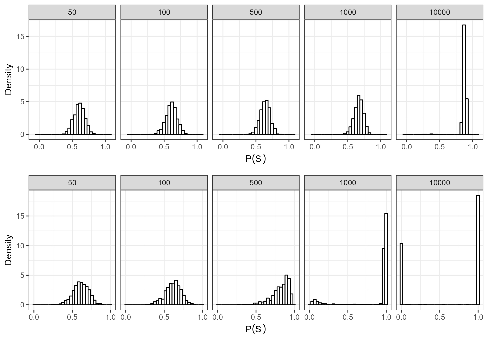
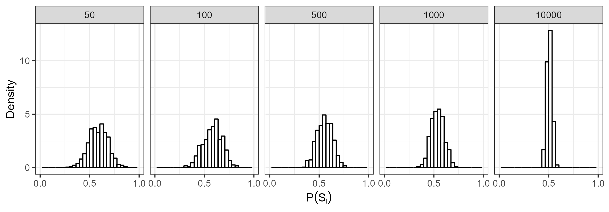

```{r setup, include = FALSE}
library("papaja")
#r_refs("r-references.bib")


```

```{r analysis-preferences}
# Seed for random number generation
set.seed(42)
knitr::opts_chunk$set(cache.extra = knitr::rand_seed)
```

# Introduction

Speakers often have great flexibility in their choices to convey a meaning. For example, speakers are often confronted with many different ways to express the same meaning. A customer might ask whether a store sells "radios and televisions", but they could have just as naturally asked whether the store sells "televisions and radios." However, despite conveying the same meaning, speakers sometimes have strong preferences for one choice over competing choices [e.g., preference for *men and women* over *women and men*, @benor2006; @morgan2016]. These preferences are driven to some extent by generative preferences (e.g., preference for short words before long words), however they are sometimes violated by idiosyncratic preferences [e.g., *ladies and gentlemen* preferred despite a general men-before-women generative preference, @morganFrequencydependentRegularizationIterated2016].

Interestingly, ordering preferences are often more extreme for higher frequency items (e.g., *bread and butter*). That is, higher-frequency items typically have more polarized preferences [@liu2020; @liu2021; @morganFrequencydependentRegularizationIterated2016; @morganModelingIdiosyncraticPreferences2015; @morgan2016]. However, it is still unclear what processeses this phenomenon, called frequency-dependent regularization, is driven by. In the present paper we examine whether a noisy-channel processing model [@gibsonNoisy2013] combined with transmission across generations [@realiEvolutionFrequencyDistributions2009] can account for frequency-dependent regularization.

## Frequency-dependent regularization

In the last decade, frequency-dependent regularization – the phenomena of more frequent items having more extreme ordering preferences – has been documented for a variety of different constructions in English [@liu2020; @liu2021; @morganFrequencydependentRegularizationIterated2016; @morganModelingIdiosyncraticPreferences2015]. For example, @morganModelingIdiosyncraticPreferences2015 demonstrated that more frequent binomial expressions (e.g., *bread and butter*) are more strongly regularized (i.e., are preferred in one order overwhelmingly more than the alternative). These ordering preferences are also not simply a result of abstract ordering preferences [e.g., short words before long words, @morgan2016].

Additionally, @liu2020 demonstrated this effect holds true for the dative alternation in English (e.g., *give* *the ball to him* vs *give him the ball*). Specifically, they demonstrated higher frequency verbs have more polarized preferences with respect to the dative alternation. Similarly, @liu2021 showed that Adjective-Adjective-Noun orderings also show frequency-dependent regularization. That is, adjective-adjective-Nouns with higher head noun frequencies show stronger ordering preferences, even after taking into account generative preferences of adjective orderings.

How does this polarization for high-frequency items arise? One possibility is that it occurs as a consequence of imperfect transmission between generations. For example, @morganFrequencydependentRegularizationIterated2016 demonstrated that in an iterated-learning paradigm [@realiEvolutionFrequencyDistributions2009], this frequency-dependent regularization can arise from an interaction between a frequency-independent bias and transmission across generations. Specifically, they used an iterated learning paradigm [following @realiEvolutionFrequencyDistributions2009] and demonstrated that by introducing a frequency-independent regularization bias, after several generations the model predicted frequency-*dependent* regularization. However, it is unclear what process in language is analogous to the frequency-independent bias.

## Noisy-channel Processing

One possibility is that frequency-dependent regularization arises as a product of noisy-channel processing [@gibsonNoisy2013]. That is, listeners are confronted with a great deal of noise in the form of perception errors (e.g., a noisy environment) and even production errors [speakers don't always say what they intended to, @gibsonNoisy2013]. In order to overcome these errors, a processing system must take into account the noise of the system.

Indeed, there is evidence that our processing system does take noise into account. For example, @ganongPhoneticCategorizationAuditory1980 presented people with word-nonword continuums, where the VOT of the initial consonant was manipulated (e.g., *task*-*dask*). He found that when people are presented with a word in which the initial phoneme was close to the VOT boundary, people will process the segment as being the word, rather than the non-word, even when the VOT was incongruous with the interpretation. Further, @feltyMisperceptionsSpokenWords demonstrated that when listeners do misperceive a word, the word that they believe to have heard tends to be higher frequency than the target word. This suggests that misperceptions may sometimes actually be a consequence of noisy-channel processing (rather than a failure of our perceptual system).

In order to account for findings like these, @gibsonNoisy2013 developed a computational model that demonstrated how a system might take into account noise. Specifically, their model operationalizes noisy-channel processing as a Bayesian process where a listener estimates the probability that their perception matches the speaker's intended utterance. Specifically, this is operationlized as being proportional to the likelihood of the intended utterance multiplied by the probability of the intended utterance being corrupted to the perceived utterance (See Equation \@ref(eq:gibsonnoisy)):

```{=tex}
\begin{equation}
(\#eq:gibsonnoisy)
P(S_i|s_p) \propto P(S_i) P(S_i \to S_p)
\end{equation}
```
@gibsonNoisy2013's model made a variety of interesting predictions. For example, the model predicted that when people are presented with an implausible sentence (e.g., *the mother gave the candle the daughter*), they should be more likely to interpret the plausible version of the sentence (e.g., *the mother gave the candle to the daughter*) if there is increased noise (e.g., by adding errors to the filler items). Their model also predicted that increasing the likelihood of implausible events should increase the rate of implausible interpretations of the sentence. Interestingly both of these results were born out in their experimental data, suggesting that humans do utilize a noisy-channel system in processing.

## Present Study

Given the evidence of noisy-channel processing, it is possible that the frequency-dependent regularization that @morganFrequencydependentRegularizationIterated2016 saw is a product of listeners' noisy-channel processing. That is, perhaps the regularization bias responsible for the regularization across generations is a consequence of noisy-channel processing. Thus, the present study examines whether @gibsonNoisy2013's noisy-channel processing model can also predict frequency-dependent regularization across generations of language transmission.

# Dataset

Following @morganFrequencydependentRegularizationIterated2016, we use @morganModelingIdiosyncraticPreferences2015's corpus of 594 binomial expressions. This corpus has been annotated for various phonological, semantic, and lexical constraints that are known to affect binomial ordering preferences. The corpus also includes estimated generative preferences for each binomial (i.e., compositional ordering preferences, estimated from the above constraints) and observed binomial orderings (the proportion of binomial orderings that are in alphabetical form for a given binomial). A visualization of the distribution of observed preferences and compositional preferences is included below in Figure \@ref(fig:corpusplot1) , on the left and right respectively.

(ref:corpusplotcaption1) The left plot is a plot of the relative orderings of binomials in the corpus data from @morganModelingIdiosyncraticPreferences2015, the right is the plot of the generative preferences of binomials in the same corpus. The x-axis is proportion of occurrences in alphabetical order and the y-axis is the probability density.

```{r corpusplot1, echo = F, out.width = '100%', fig.align = 'center', warning = F, message = F, fig.cap = '(ref:corpusplotcaption1)'}
knitr::include_graphics('Figures/corpus_plots.png')
```

# Model

Following @realiEvolutionFrequencyDistributions2009, we use a 2-alternative iterated learning paradigm. A learner hears N tokens of a binomial expression and then produces N tokens for the next generation. After hearing N tokens, they infer the probability, $\theta$, of the alphabetical form of the binomial. Using that probability, they then produce N tokens for the next generation, and this process continues iteratively.

The prior probability of a binomial's ordering is operationalized using the beta distribution [following @morganFrequencydependentRegularizationIterated2016]. Specifically, we treat the generative preference for a given binomial as the prior for our model. This is operationalized using the beta distribution with $\mu_{prior}$, which is the generative preference for a given binomial, and $\nu$, which determines the strength of the belief of the prior probability. Thus the prior probability for a given binomial in its alphabetical form is estimated as:

```{=tex}
\begin{equation}
(\#eq:thetaPrior)
P(\theta_{prior}) = \frac{\mu_{prior} \cdot \nu}{(\mu_{prior} \cdot \nu) + \nu(1 - \mu_{prior})}
\end{equation}
```
and the probability of hearing it in non-alphabetical form is $1-P(\theta_{prior})$.

This is then used as the prior in @gibsonNoisy2013's noisy-channel processing model, such that if a listener hears the alphabetical form of a binomial they update the probability of hearing it in alphabetical form according to the following parametrization,

```{=tex}
\begin{equation}
(\#eq:phatAlpha)
\hat{p}(\alpha) \propto \frac{\mu_{prior} \cdot \nu}{(\mu_{prior} \cdot \nu) + \nu(1 - \mu_{prior})} \cdot P(noise)
\end{equation}
```
where $p_{noise}$ is a fixed parameter for every binomial, representing the probability of mis-hearing a binomial expression. They also update the probability of hearing the non-alphabetical form:

```{=tex}
\begin{equation}
(\#eq:phatNonalpha)
\hat{p}(\neg\alpha) \propto 1 - \frac{\mu_{prior} \cdot \nu}{(\mu_{prior} \cdot \nu) + \nu(1 - \mu_{prior})} \cdot (1-P(noise))
\end{equation}
```
If the listener hears the non-alphabetical form of the binomial, they update using the same equations, but instead the likelihood of hearing the alphabetical form is $p(noise)$, and the likelihood of hearing the non-alphabetical form is $1-p(noise)$ (since hearing the non-alphabetical form is infact being faithful to the data in this context). Thus the estimated probability of the alphabetical form of the binomial is updated according to:

```{=tex}
\begin{equation}
(\#eq:phatAlpha2)
\hat{p}(\alpha) \propto \frac{\mu_{prior} \cdot \nu}{(\mu_{prior} \cdot \nu) + \nu(1 - \mu_{prior})} \cdot P(noise) 
\end{equation}
```
and the estimated probability of the non-alphabetical form is updated according to:

```{=tex}
\begin{equation}
(\#eq:phatNonalpha2)
\hat{p}(\neg\alpha) \propto 1 - \frac{\mu_{prior} \cdot \nu}{(\mu_{prior} \cdot \nu) + (1 - \mu_{prior}) \cdot \nu} \cdot (1-P(noise)) 
\end{equation}
```
Finally, before $\hat{p}_\alpha$ and $\hat{p}_{\neg\alpha}$ are updated, the un-normalized estimates of the alphabetical and non-alphabetical above are normalized such that they sum to 1.[^1]

[^1]: The full computational implementation can be found in the `iterated_learning.R` script in the github repository.

Once the learner finishes hearing N tokens, they then produce N tokens generated binomially, where $\theta_1$ is their inferred probability of the alphabetical form of the given binomial (which is set to 0.5 for the first generation):

```{=tex}
\begin{equation}
(\#eq:binomialProd)
P(x_1|\theta_1) = \binom{N}{x_1} \theta^{x_1} (1-\theta_1)^{N-x_1}
\end{equation}
```
When the learner produces the N tokens, there is also a possibility the speaker will make an error. This is also generated binomially, with $\theta_1$ being a fixed parameter, which is the probability that the learner makes an error. In our model, if the learner makes an error, the opposite ordering of a given binomial is produced. For example, if the learner intends to produce *bread and butter* and makes an error, *butter and bread* is produced.

# Results

## Speaker vs Listener Noise

First we demonstrate that frequency-dependent regularization does not arise when there is no listener or speaker noise.[^2] Instead we see convergence to the prior, which is expected. That is, @griffithsLanguageEvolutionIterated2007 demonstrated that when learners sample from the posterior, as the number of iterations increases, the stationary distribution converges to the prior. In other words, without any noise, each generation of learners produces data that is more and more similar to the prior, until convergence is reached (Figure \@ref(fig:noNoisePlot)).

[^2]: All code and results can be found publicly available here: <https://github.com/znhoughton/Noisy-Channel-Iterated-Learning>

(ref:noNoisePlotCap) A plot of the distribution of simulated binomials at the 500th generation, varying in frequency. The top value represents N. On the x-axis is the predicted probability of producing the binomial in alphabetical form. On the y-axis is probability density. Speaker and listener noise was set to 0. The generative preference was 0.6, and nu was set to 10. 1000 chains were run. Note that there is no frequency-dependent regularization apparent.

```{r noNoisePlot, echo = F, out.width = '100%', fig.align = 'center', warning = F, message = F, fig.cap = '(ref:noNoisePlotCap)'}
knitr::include_graphics('Figures/noNoise.png')
```

However, when we introduce noise (Figure \@ref(fig:regularizationplot1)), we see that the model can predict frequency-dependent regularization across generations.

(ref:regularizationPlot1Cap) A plot of the distribution of simulated binomials at the 500th generation, varying in frequency. The top value represents N. On the x-axis is the predicted probability of producing the binomial in alphabetical form. On the y-axis is probability density. Speaker noise was set to 0.001, listener noise was set to 0.01, the generative preference was 0.6, and nu was set to 10. 1000 chains were run. Note how for the binomials with large N, the ordering preferences tend to be more extreme.

```{r regularizationplot1, echo = F, out.width = '100%', fig.align = 'center', warning = F, message = F, fig.cap = '(ref:regularizationPlot1Cap)'}
knitr::include_graphics('Figures/speaker_noise_001_listener_01.png')
```

Further, the disparity of the noise affects the rate of regularization. Increased noise results in weaker regularization (i.e., less regularization for lower frequency items, see Figure \@ref(fig:absolutediff)), however a larger relative difference between the speaker and listener noise parameters increases both the strength and the speed of the regularization (see Figure \@ref(fig:fasterslowerreg)).

(ref:fasterSlowerRegCap) A plot of simulations with different noise parameters at 500 (top plots) and 2000 (bottom plots) generations. For the left plots, the speaker noise was set to 0.009 and the listener noise parameter was set to 0.01. For the right plots, the speaker noise was set to 0.0075 and the listener noise parameter was set to 0.01. For both plots, the generative preference was set to 0.6 and nu was set to 10.

```{r fasterslowerreg, echo = F, out.width = '100%', fig.align = 'center', warning = F, message = F, fig.cap = '(ref:fasterSlowerRegCap)'}
knitr::include_graphics('Figures/fasterSlowerReg.png')
```

(ref:absoluteDiffMattersCap) A plot of simulations with different noise parameters, but the same relative difference between the speaker and listener noise parameters. The top plot For the top plot, the speaker noise was set to 0.091 and listener noise was set to 0.1. For the bottom plot, the speaker noise was set to 0.001 and listener noise was set to 0.01. Note that the relative difference between the listener and speaker noise parameters for both plots was the same (0.009).

```{r absolutediff, echo = F, out.width = '100%', fig.align = 'center', warning = F, message = F, fig.cap = '(ref:absoluteDiffMattersCap)'}

```

Interestingly this regularization disappears if the listener's noise parameter is less than or equal to the speaker's noise parameter (Figure \@ref(fig:regularizationplot2)).

(ref:regularizationPlot2Cap) A plot of the distribution of simulated binomials at the 500th generation, varying in frequency. The top value represents N. On the x-axis is the predicted probability of producing the binomial in alphabetical form. On the y-axis is probability density. Speaker noise was set to 0.01, listener noise was set to 0.001, the generative preference was 0.6, and nu was set to 10. 1000 chains were run. Note how regularization does not appear to be present in this graph.

```{r regularizationplot2, echo = F, out.width = '100%', fig.align = 'center', warning = F, message = F, fig.cap = '(ref:regularizationPlot2Cap)'}


```

It is useful to revisit here what the speaker and listener noise parameters represent. The speaker noise parameter is how often the speaker produces an error and the listener noise parameter is the listeners' belief of how noisy the environment is. Framed this way, it is perhaps unsurprising that we do not see regularization when the parameters equal eachother, since they essentially cancel eachother out (everytime a speaker makes an error, the listener is accounting for it, thus we get convergence to the prior).

Thus our model makes a novel prediction: In order to account for frequency-dependent regularization, listeners must be inferring more noise than speakers are actually producing (according to our model).

## Corpus Data

Finally, we now demonstrate that our model also predicts the language-wide distribution of binomial preference strengths seen in the corpus data. Specifically, we show that with $\nu$ set to 10, listener noise set to 0.02, and speaker noise set to 0.005, our model does a pretty good job of approximating the distribution in the corpus data (See Figure \@ref(fig:corpusourmodel)).

(ref:corpusourmodelcap) A plot of the distribution of ordering preferences after 500 generations of our iterated learning model (left) and the distribution of ordering preferences in the corpus data from @morganModelingIdiosyncraticPreferences2015. For our simulations, the binomial frequencies and generative preferences were matched with the corpus data. $\nu$ was set to 10, listener noise was set to 0.02, and speaker noise was set to 0.005.

```{r corpusourmodel, echo = F, out.width = '100%', fig.align = 'center', warning = F, message = F, fig.cap = '(ref:corpusourmodelcap)'}
knitr::include_graphics('Figures/corpus_plot_and_ours.png') 
```

# Conclusion

Our results demonstrate the frequency-dependent regularization emerges from a noisy-channel processing model [@gibsonNoisy2013] in an iterative-learning paradigm [@realiEvolutionFrequencyDistributions2009] when listeners assume more noise in the environment than the speakers actually produce.

Further our results suggest that in order to account for frequency-dependent regularization, listeners are inferring more noise than speakers are producing. An interesting avenue for future research is whether this prediction is born out in experimental work.

\newpage

# References

::: {#refs custom-style="Bibliography"}
:::
